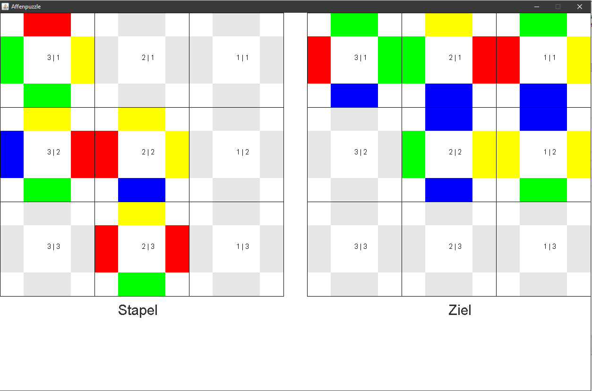

# Affenpuzzle (February 2018)
Affenpuzzle Solving Algorithm
<br>*by Elias Theis ([@eliastheis](https://github.com/eliastheis))*

## How it works
The problem is described [here](https://www.inf-schule.de/grenzen/komplexitaet/affenpuzzle/einstieg_affenpuzzle).
The puzzle-solving-algorithm uses indirect recursion with two fields to try every useful combination fo cards.
If you remove all ```Thread.sleep()``` calls the puzzle will be solved in less than a second.

## Start your own adventure
Execute the main-method from ```/src/main/Affenpuzzle.java```

## Screenshot

